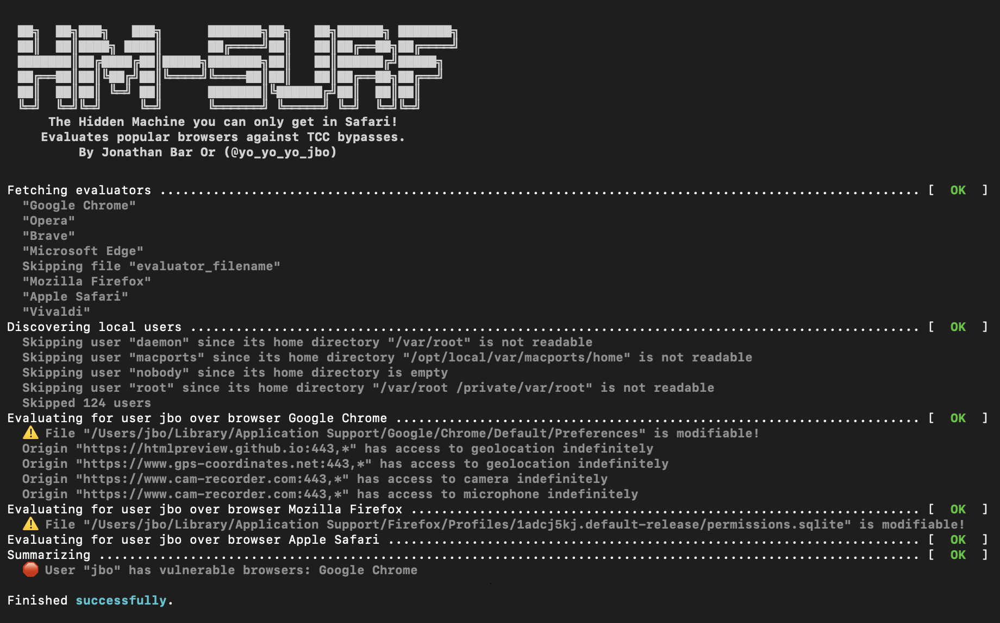

# HM-Surf evaluator
Evaluates susceptibility to [CVE-2024-44133](https://nvd.nist.gov/vuln/detail/CVE-2024-44133) of common macOS browsers.  
Also contains the HTML that takes a screenshot and downloads it along with location extraction.


## Usage - evaluator
To run the evaluator, which evaluates [CVE-2024-44133](https://nvd.nist.gov/vuln/detail/CVE-2024-44133) on all common macOS browsers, run:

```shell
python3 -m pip install -r ./requirements.txt
./hm-surf-eval.py
```

Upon execution, the tool evaluates TCC bypassing capabilities of all common macOS browsers.

## Usage - HTML
The file [hm-surf.html](hm-surf.html) is an example HTML page that demontrates [CVE-2024-44133](https://nvd.nist.gov/vuln/detail/CVE-2024-44133).  
All it does is access the camera and location, presenting the location (with low accuracy, on purpose) and downloads the camera screenshot (but it could just as easily save it on a server).  
This file is *not* an exploit by itself, and requires Camera, Microphone and location access enabled for the browser, e.g. by a local attacker overriding the per-browser preferences.  
That capability can be assessed with the evaluator.  
To view the HTML page easily, you could use any tool, e.g. [htmlpreview](http://htmlpreview.github.io/?https://github.com/yo-yo-yo-jbo/hm-surf/blob/main/hm-surf.html).

## Coding
Coding an evaluator is quite easy - you inherit from `BrowserEvaluatorBase` and implement two methods:
- `get_browser_name` - retrieves a human-readable browser name.
- `evaluate` - gets the `username` and its `home_dir` and evaluates susceptibility. Returning `None` means browser is not susceptible, while returning a `BrowserResults` instance yields susceptible results.

Note there's also a `ChromiumEvaluatorBase` base class for Chromium-based browsers, which means you have to implement the usual `get_browser_name` and also a `get_preference_filepath` method that returns a preference file path for the given home directory. You do not have to implement `evaluate` for Chromium-based browsers, that's implemented by the base class.
